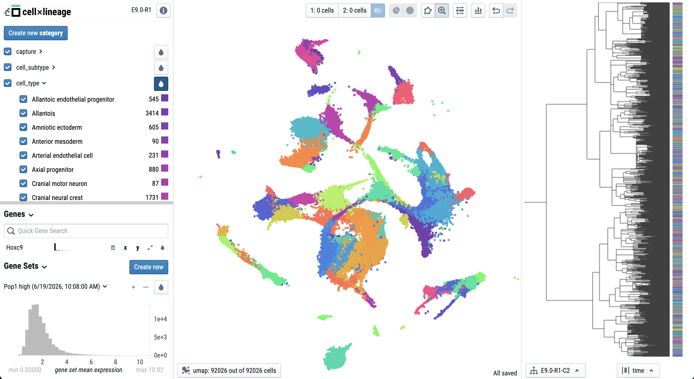

_An interactive explorer for single-cell lineage tracing._

CELLxLINEAGE is a fork of [CELLxGENE](https://cellxgene.cziscience.com/docs/01__CellxGene) extended to support [TreeData](https://github.com/YosefLab/treedata) objects and lineage tree visualization alongside the standard UMAP embedding.



## Installation

You need to have Python 3.10 or newer installed on your system. If you don't have
Python installed, we recommend installing [Mambaforge](https://github.com/conda-forge/miniforge#mambaforge).

Install the latest release of `cellxlineage` from [PyPI](https://pypi.org/project/cellxlineage):

```bash
pip install cellxlineage
```

## Usage

```bash
# Launch with a TreeData file
cellxlineage launch data.h5td
```

## CELLxGENE documentation

CELLxLINEAGE inherits all standard CELLxGENE Annotate features. For documentation on exploration, filtering, differential expression, and annotations, see the [CELLxGENE Annotate documentation](https://cellxgene.cziscience.com/docs/01__CellxGene).

## Hosting

CELLxLINEAGE can be hosted for a small group (≈10 concurrent users) to explore
one shared dataset. Add `--ephemeral-annotations`:

```bash
cellxlineage launch data.h5td --host 0.0.0.0 --port 5005 --ephemeral-annotations
```

In this mode:

- **No "user generated data directory" prompt.** Custom annotations and gene sets
  are kept in memory, per browser session, and never written to disk.
- **Annotations reset on reload** and are isolated between users — reloading the
  page or a new visitor starts from a clean slate. Differential expression is
  already per-session and resets the same way.

Notes:

- Run as a **single process** — the in-memory annotations and lineage caches live
  in that process, so multiple workers would not share them. The built-in
  threaded server is fine for a small trusted group; to harden it, put it behind a
  reverse proxy (e.g. nginx) and, if you want a production WSGI server, run
  gunicorn with `--workers 1 --threads N`.
- Do **not** pass `--backed` in this mode (rejected at startup): concurrent reads
  on a single shared file handle are unsafe. The default in-memory data load is
  what you want.
- A heavy differential-expression or ancestral-linkage request briefly occupies
  the process; at this scale that is acceptable.

## Contact

For questions and bug reports please use the [issue tracker](https://github.com/colganwi/cellxlineage/issues).

## License

MIT — see [LICENSE](LICENSE). Portions copyright Chan Zuckerberg Initiative; lineage extensions copyright William Colgan.

